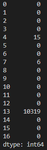
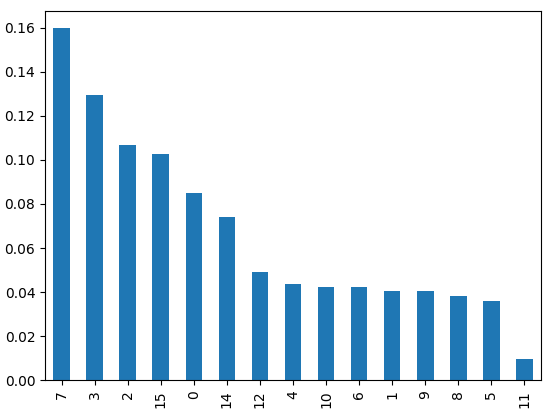

# Eyelids detection
## Data Exploration
* In eeg_train.csv we have 10486 measurements of 16 variables and 1 target label. 
    * label 1 = eyes open
    * label 2 = eyes closed

## Data Cleaning
### Train Data

* After first look at the data, we can see that the column 13 contains 10319 missing values, which represents 98.4% of the data. For this reason, we will drop this column.
* Also the column 4 contains 15 missing values, which represents 0.1% of the data, and column 7 contains 6 missing values, which represents 0.1% of the data. For this reason, we will drop these rows.
### Test Data
* Test data does not contain any missing values.
* To have the same variables in train and test data, we will drop column 13 from test data, same as we did with train data.

## Decision Tree
* We will use Decision Tree to predict the target label.
* We will use GridSearchCV to find the best parameters for Decision Tree.
* We will use 5-fold cross validation to evaluate the model.
* We will use accuracy score to evaluate the model.
* We will use confusion matrix to evaluate the model.
* We will use classification report to evaluate the model.

## Random Forest
### Important features
