# Machine Learning, Artificial Intelligence and Big Data Analytics
## <i> Code examples, assignments and notes from the course </i>

## 1. Introduction
### Definition
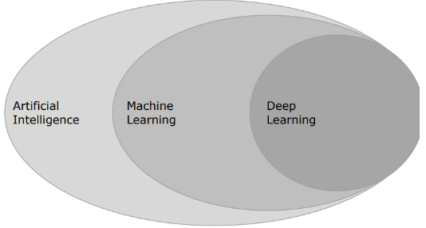

#### Artificial Intelligence
* Computer system that is able to perform tasks normally requiring human intelligence
* Performs tasks normally associated with intelligent beings  
* Involves usage of machine learning algorithm

#### Machine Learning
* Subfield of AI
* Adapts without explicit instructions
* Learn autonomously
* Improves from experience
* Make predictions and decisions based on data

#### Deep Learning
* Subfield of machine learning
* Training neural networks to learn complex features
* transform the input data into increasingly abstract representations, allowing the network to make more accurate predictions or decisions.

### Artificial Inteligence
#### Symbolic AI
* Classical AI / Rule based AI
* Uses symbolic logic
* Hardcoded rules
* Explicit representation of knowledge
* Set of rules and symbols
* Uses deductive reasoning, logical interference
* Is used in high risk domains
#### Non-symbolic AI
* Approach intelligence without specific representation of knowledge
* Learns autonomously by being trained
* Is trained with raw data
* Constructs own implicit knowledge
* Can be divide in subsymbolic and statistical AI
### Machine Learning
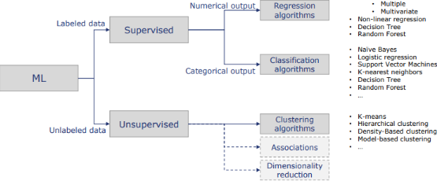

#### Supervised Learning

* Training data is labeled
* Has a set of input and expected output
* Learnes the relationship between input and output
* Predicts the output for new data
* Classification and regression
    * 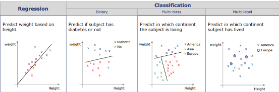
    * Classification: Predicting a discrete value
    * Regression: Predicting a continuous value
#### Unsupervised Learning
* Training data is unlabeled
* Has a set of input
* Learnes the structure and patterns of the data
#### Reinforcement Learning
* Learns from interaction with the environment
* Data consists of state, action, reward and next state.
* Learnes to maximize the reward
* Recieves feedback from reinforcement
* Learn through trial and error
#### Semi-supervised Learning
*  Using a combination of labeled and unlabeled data to train a model.
*  First trained on a small amount of labeled data.
### Deep Learning
>NOTE: This part will be updated in the future
---
## 2. Machine Learning Pipeline
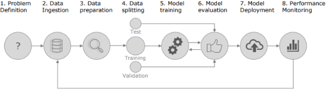

### 1. Problem Definition
* Defines the business problem
* Learning the domain
* Translate the business problem into a machine learning problem

### 2. Data Collection
* Identify the data required
* Identify the data sources
* Collect the data

### 3. Data Preparation
* Data cleaning
    * Missing values
    * Outliers
    * Duplicates
    * Irrelevant data
    * Inconsistent data
* Feature selection
* Feature engineering
### 4. Data Splitting
* Splitting the data into 2 or 3 sets
    * Training set and test set
    * Optional: Validation set
* Training set is used to train the model
* Test set is used to evaluate the model
* Validation set is used to tune the model
### 5. Model Training
* Identify the most appropriate model
* Define the minimum performance requirements
* Define the parameters of the model
* Train the model
### 6. Model Evaluation
* Evaluate the model on the test set
* Iterate the model training and evaluation process till the minimum performance requirements are met
### 7. Model Deployment
* Define how to deploy the model
* Define how to monitor the model
* Define how to update the model
* Deploy the model
### 8. Model Monitoring
* Monitor the model performance
* Identify deviations and deterioration in the model performance
---

## 3. Data Splitting
<b>>NOTE: All 2 or 3 sets MUST have similar characteristics, classes must be properly represented, propriety of the data must be preserved</b>

### Approaches
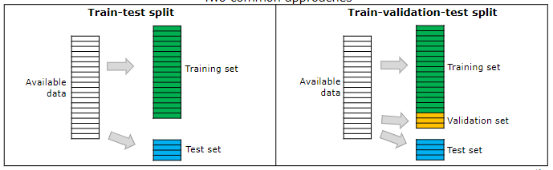

* Train/Test Split
* Train/Test/Validation Split

### Sets usage
* Training set - used to train the model
* Test set - used to evaluate the model
* Validation set - used to tune the model, by adjusting the hyperparameters in order to improve the model performance

### Strategy
* Random Split - random sampling
* Stratified Split - choose such that the proportion of classes is the same in each set
* Sequential Split - split the data in chronological order
### Propotion
>NOTE: The proportion of the sets depends on the size of the dataset and the number of features. For example in large datasets, the test can aslo be 5-10% of the dataset.
* Train/Test Split
    * 80/20
    * 75/25
    * 70/30
* Train/Test/Validation Split
    * 60/20/20
    * 70/15/15
    * 80/10/10
    * 50/25/25
---
## 4. Supervised Learning Algorithms
### Linear based algorithms
#### Linear Regression
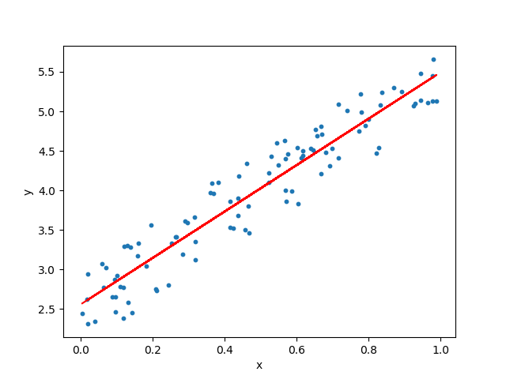

##### Principles
* Predicts the value of a continuous variable based on one or more continuous variables
* It models the relationship with a straight line.
* Fit linear model with coefficients w = (w1, w2, ..., wn) to minimize the sum of squared errors.
* y = w0 + w1 * x1 + w2 * x2 + ... + wn * xn
##### Use cases
* Predicting the value of a continuous variable based on other continuous variables
##### Advantages
* Simple to understand 
* Interpretable
* Fast to train
* Fast to predict
* No tuning required
* Performs well with linearly separable data
##### Disadvantages
* Assumes a linear relationship between the features and the target
* Poor performance with non-linear data
* Sensitive to outliers
* Sensitive to the scale of the data
* Poor performance with high dimensional data
##### Assumptions
* Linear relationship between the features and the target
* Features are independent
* Features are normally distributed
* Features have equal variance
* Features are not correlated with the errors
##### Python Implementation
```python
from sklearn.linear_model import LinearRegression
model = LinearRegression()
model.fit(X_train, y_train)
y_pred = model.predict(X_test)
```
##### R Implementation
```R
model <- lm(y ~ x1 + x2 + ... + xn)
y_pred <- predict(model, X_test)
```
#### Polynomial Regression
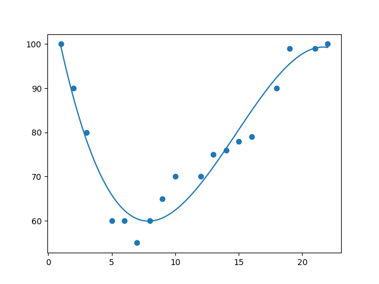

##### Principles
* Predicting a continuous target variable based on one or more input features.
* It models the relationship between the input features and the target variable using a polynomial curve of a higher degree than one.
* Find the best-fit curve that minimizes the difference between the predicted values and the actual values in the training data.
* Fit a polynomial model with coefficients w = (w1, w2, ..., wn) to minimize the sum of squared errors.
* y = β0 + β1x + β2x^2 + ... + βn*x^n + ε
##### Use cases
* Predicting the value of a continuous variable based on other continuous variables
##### Advantages
* Can capture non-linear relationships
* More accurate than linear regression
* Wider range of input variable
##### Disadvantages
* More complex and harder to interpret
* More computationally expensive then linear regression
* Sensitivity to overfitting on high degree polynomials
##### Assumptions
* Non-linear relationship between the features and the target
* Features are independent
* Features are normally distributed
* Features are not correlated with the errors
##### Python Implementation
```python
from sklearn.preprocessing import PolynomialFeatures
from sklearn.linear_model import LinearRegression
poly = PolynomialFeatures(degree=2)  # the degree represents the complexity of the model
# to find the best degree we can use a basic forloop and plot the MSE
# when it goes fast up we can stop
X_train_poly = poly.fit_transform(X_train)
X_test_poly = poly.fit_transform(X_test)
model = LinearRegression()
model.fit(X_train_poly, y_train)
y_pred = model.predict(X_test_poly)
```
##### R Implementation
```R
model <- lm(y ~ poly(x1, 2) + poly(x2, 2) + ... + poly(xn, 2))
y_pred <- predict(model, X_test)
```
>NOTE: The difference between Polynomial Regression and Linear Regression is that Polynomial Regression is a special case of Linear Regression, where the features are transformed into polynomial features. Also the Polynomial uses a curve to fit the data, while Linear Regression uses a straight line.
#### Ridge Regression
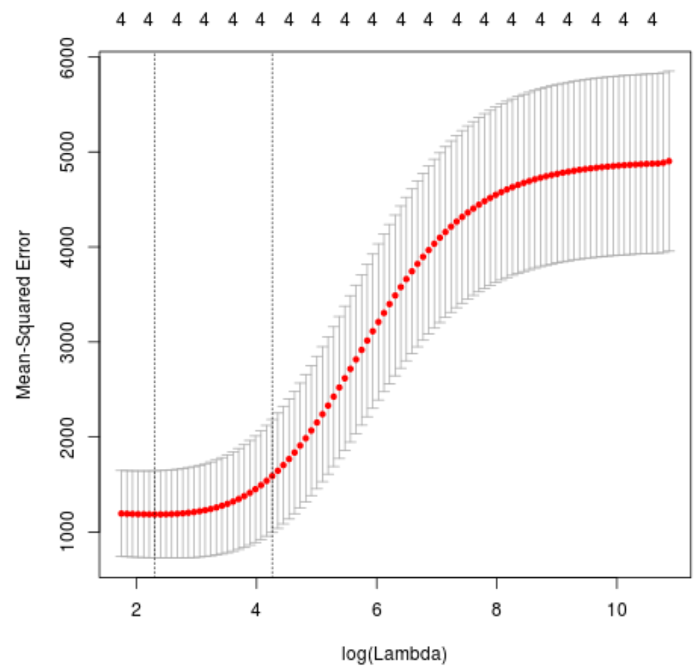

##### Principles
* Regularized linear regression that is used to prevent overfitting
* Adds penalty to coefficients to reduce the complexity of the model
* Minimizes the sum of squared errors and the sum of squared coefficients
* y = β0 + β1x1 + β2x2 + ... + βp*xp + ε
##### Use cases
* Predicting the value of a continuous variable based on other continuous variables
##### Advantages
* Prevents overfitting
* Reduces the variance of the model
* Can handle highly correlated features
* Provides more reliable predictions
* Computationally efficient
##### Disadvantages
* Biased estimates of the regression coefficients
* Can be difficult ot chose the regularization parameter
##### Assumptions
* Linear relationship between the features and the target
* Features are independent
* Features are normally distributed
* Features have equal variance
* Features are not correlated with the errors
##### Python Implementation
```python
from sklearn.linear_model import Ridge
model = Ridge(alpha=1.0)  # alpha is the regularization parameter
model.fit(X_train, y_train)
y_pred = model.predict(X_test)
```
##### R Implementation
```R
model <- lm(y ~ x1 + x2 + ... + xn, ridge=TRUE, lambda=1.0)
y_pred <- predict(model, X_test)
```

#### Lasso Regression
##### Principles
* Regularized linear regression that is used to prevent overfitting
* Adds penalty to coefficients to reduce the complexity of the model
* Minimizes the sum of squared errors and the sum of absolute values of the coefficients
* y = β0 + β1x1 + β2x2 + ... + βp*xp + ε
##### Use cases
* Predicting the value of a continuous variable based on other continuous variables
* Usefull for high dimensional data, with many features
##### Advantages
* Improve generalization
* Prevents overfitting
* Can handle highly correlated features
* More interpretable than Ridge Regression
* Computationally efficient
##### Disadvantages
* Biased estimates of the regression coefficients
##### Assumptions
* Linear relationship between the features and the target
* Features are independent
* Features are normally distributed
```python
from sklearn.linear_model import Lasso
model = Lasso(alpha=1.0)  # alpha is the regularization parameter
model.fit(X_train, y_train)
y_pred = model.predict(X_test)
```
##### R Implementation
```R
model <- lm(y ~ x1 + x2 + ... + xn, lasso=TRUE, lambda=1.0)
y_pred <- predict(model, X_test)
```
>NOTE: The difference between Ridge Regression and Lasso Regression is that Ridge Regression uses the sum of squared coefficients, while Lasso Regression uses the sum of absolute values of the coefficients.
#### Support Vector Machine
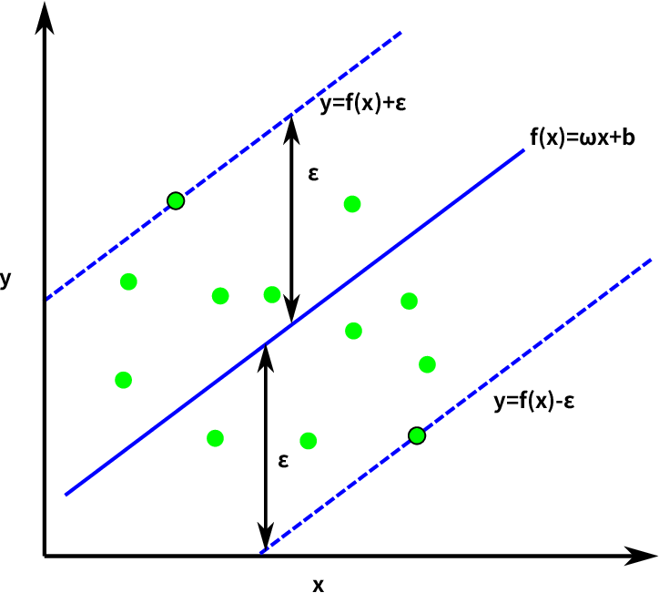

##### Principles
* Finds the optimal hyperplane that separates the input data into different classes.
* Uesd for both classification and regression problems.
* SVM maximizes the margin between the hyperplane and the closest points from each class, which leads to better generalization performance.
* y = sign(w·x + b)
##### Use cases
* Classification
* Image recognition
* Outlier detection
##### Advantages
* Effective in high dimensional spaces
* Work with both linearly and non-linearly separable data
* Good generalization performance
* Resistant to outliers
##### Disadvantages
* Computationally expensive
* Sensitive to the kernel parameters
* Assumes that data is linearly separable
* Not interpretable
##### Assumptions
* Linearly separable data
* Independent features
##### Python Implementation
```python
from sklearn.svm import SVC
model = SVC(kernel='rbf', C=1.0, gamma=0.1)  # kernel is the type of kernel function, C is the regularization parameter, gamma is the kernel coefficient
model.fit(X_train, y_train)
y_pred = model.predict(X_test)
```
##### R Implementation
```R
model <- svm(y ~ x1 + x2 + ... + xn, data=data, kernel='rbf', cost=1.0, gamma=0.1)
y_pred <- predict(model, X_test)
```

### Tree Based Models
#### Decision Tree Classification


##### Principles
* Hierarchical structure with nodes and directed edges
* Tree like model that splits the data into smaller and smaller subsets
* Each subset is then classified by a decision node
* The decision nodes are created by using a splitting criterion
* Depth of the tree is the number of nodes from the root to the deepest leaf
* Depth of the node is the number of nodes from the root to the node
* size of the tree is the number of nodes in the tree
##### Use cases
* Both classification and regression problems
##### Advantages
* Easy to understand 
* Easy to interpret
* Can be used for both classification and regression problems
* Can handle both numerical and categorical data
* Can capture non-linear relationships
##### Disadvantages
* Prone to overfitting
* Sensitive to small variations in the data
* Not robust to outliers
##### Assumptions
* Independent features
##### Python Implementation
```python
from sklearn.tree import DecisionTreeClassifier
model = DecisionTreeClassifier(criterion='gini', max_depth=3)  # criterion is the splitting criterion, max_depth is the maximum depth of the tree
model.fit(X_train, y_train)
y_pred = model.predict(X_test)
```
##### R Implementation
```R
model <- rpart(y ~ x1 + x2 + ... + xn, data=data, method='class', control=rpart.control(maxdepth=3))
y_pred <- predict(model, X_test)
```
>NOTE: Gini impurity index:  measure of the probability of incorrectly classifying a randomly chosen element in a dataset if it were randomly labeled according to the distribution of labels in the dataset. Entropy: Entropy is a measure of the degree of disorder or randomness in a system, often associated with the amount of information or uncertainty present.
#### Random Forest Classification
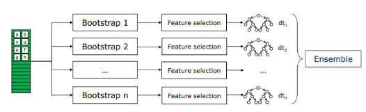

##### Principles
* Ensemble learning method that uses multiple decision trees to make predictions
* Each tree is trained on a different subset of the data
* 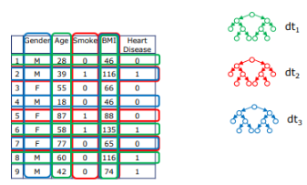
* Each tree is trained on a different subset of the features
* The final prediction is the mode of the predictions of the individual trees
* Bagging + Decision Trees
##### Use cases
* Both classification and regression problems
* Can be used for feature selection
* Good with high dimensional data
* Good with non-linear data
##### Advantages
* Can handle both numerical and categorical data
* Can capture non-linear relationships
* Can be used for both classification and regression problems
* Can provide feature importance
##### Disadvantages
* Computationally expensive
* Difficult to interpret
* May not perform well with imbalanced data
##### Extra Features
* Out of bag samples - a subset of training data that is used for validation
* Feature importance - the importance of each feature in the model
    * Mean decrease in impurity - the average decrease in impurity of the nodes that use the feature
    * Feature permutation importance - the decrease in the model's accuracy when the feature is randomly shuffled
##### Assumptions
* Assumes that the data is independent
##### Python Implementation
```python
from sklearn.ensemble import RandomForestClassifier
model = RandomForestClassifier(n_estimators=100, criterion='gini', max_depth=3)  # n_estimators is the number of trees, criterion is the splitting criterion, max_depth is the maximum depth of the tree
model.fit(X_train, y_train)
y_pred = model.predict(X_test)
```
##### R Implementation
```R
model <- randomForest(y ~ x1 + x2 + ... + xn, data=data, ntree=100, mtry=3, importance=TRUE)
y_pred <- predict(model, X_test)
```


#### AdaBoost Classification
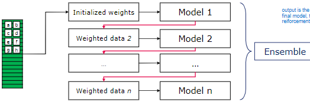

##### Principles
* Ensemble learning method that uses multiple decision trees to make predictions
* Boosting + Decision Trees
* Combines weak learners to create a strong learner
* Outputs a weighted sum of the predictions of the individual trees
* Each learner is trained on the data that was misclassified by the previous learner
##### Use cases
* Both classification and regression problems
* Can be used for feature selection
* Mainly used fir classification problems
##### Advantages
* Easy to implement
* Can be used for both classification and regression problems
* Less prone to overfitting
* Improves the accuracy of the model by combining weak learners
##### Disadvantages
* Computationally expensive
* Sensitivity to noisy data and outliers
* Difficult to interpret
##### Assumptions
* Assumes that the data is independent
* Assumes that weak learners are better than random guessing
##### Python Implementation
```python
from sklearn.ensemble import AdaBoostClassifier
model = AdaBoostClassifier(n_estimators=100, learning_rate=1.0)  # n_estimators is the number of trees, learning_rate is the learning rate
model.fit(X_train, y_train)
y_pred = model.predict(X_test)
```
##### R Implementation
```R
model <- adaboost(y ~ x1 + x2 + ... + xn, data=data, ntree=100, control=adaboost.control(interaction.depth=1))
y_pred <- predict(model, X_test)
```
#### Gradient Boosting Classification
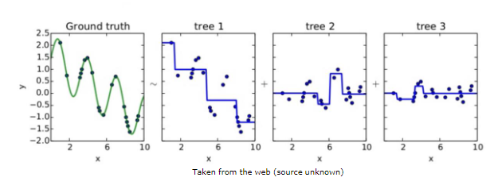

##### Principles
* Ensemble learning method that uses multiple decision trees to make predictions
* Boosting + Decision Trees
* Combines weak learners to create a strong learner
* Outputs a weighted sum of the predictions of the individual trees
* Each model passes the error to the next model
##### Use cases
* Both classification and regression problems
##### Advantages
* Can be used for both classification and regression problems
* Hihgly accurate
* Less prone to overfitting
* Can handle both numerical and categorical data
##### Disadvantages
* Computationally expensive
* Difficult to interpret
* Sensitivity to noisy data and outliers
##### Assumptions
* Loss function is differentiable
* Weak learners are better than random guessing
##### Python Implementation
```python
from sklearn.ensemble import GradientBoostingClassifier
model = GradientBoostingClassifier(n_estimators=100, learning_rate=1.0, max_depth=1)  # n_estimators is the number of trees, learning_rate is the learning rate, max_depth is the maximum depth of the tree
model.fit(X_train, y_train)
predictions = model.predict(X_test)
```
##### R Implementation
```R
model <- gbm(y ~ x1 + x2 + ... + xn, data=data, distribution='bernoulli', n.trees=100, shrinkage=0.1, interaction.depth=1)
y_pred <- predict(model, X_test)
```
#### XGBoost Classification (Extreme Gradient Boosting)
>TODO: Add XGBoost Classification image representation
##### Principles
* training decision trees on the residuals of the previous iteration to minimize the loss function.
* regularized objective function that incorporates both the training loss and a penalty on the complexity of the model, to prevent overfitting and improve generalization performance.
* XGBoost also employs a variety of advanced optimization techniques, such as parallel processing, distributed computing, and early stopping, to improve training speed and efficiency.
##### Use cases
* Both classification and regression problems
##### Advantages
* Can be used for both classification and regression problems
* has achieved state-of-the-art results on many machine learning benchmark datasets.
* Hihgly scalable
* Can handle missing values
##### Disadvantages
* Prone to overfitting
* Computationally expensive
##### Assumptions
* Independent data
* Identical distribution of training and test data
##### Python Implementation
```python
from xgboost import XGBClassifier
model = XGBClassifier()
model.fit(X_train, y_train)
y_pred = model.predict(X_test)
```
##### R Implementation
```R
model <- xgboost(data = data, label = y, nrounds = 10, max_depth = 2, eta = 1, objective = "binary:logistic")
y_pred <- predict(model, X_test)
```


### K-Nearest Neighbors(kNN)


#### Principles
* Supervised learning algorithm
* Very simple algorithm
* Does not require training
* Based on concept of neighborhood
* Classify a sample based on its neighbors
* K is the number of nearest neighbors to be considered
* does not take any assumptions about the data

#### Use cases
* Used for classification and regression problems

#### How to compute the distance between two points?
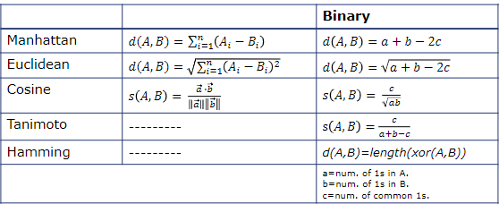

##### Euclidean Distance
* First choice in case of numerical features
* d = sqrt((x1 - x2)^2 + (y1 - y2)^2) # pythagorean theorem
* Works well with numerical features
* Limitations are different scales of the features
* Works not well with high dimensional data
* Cannot work very well with categorical features, because it will make the categorical features more important than the numerical features
    * The numeric variables will also be encoded in variables in the range of 0 to 1, which will make the distance between the points smaller
##### Manhattan Distance
* sum of the absolute differences of their x and y coordinates
* used when features are of different scales
* more resistant to outliers
* d = |x1 - x2| + |y1 - y2|
##### Chebyshev Distance
* measures the distance between two points based on the variable that has greater difference
* robust to outliers and noise
* can be sensitive to scaling and normalization
* d = max(|x1 - x2|, |y1 - y2|)
##### Mainkowski Distance
* Generealized distance metric (Euclidean, Manhattan, Chebyshev)
* usefull when we give more improtance to some features
* d = (|x1 - x2|^p + |y1 - y2|^p)^(1/p)
* p is important
##### Cosine Similarity
* It measures only different orientaions but not the difference in magnitude
* cosine similarity ranges from -1 to 1
* when dealing with hifh dimensional data
* 1 - cosine similarity = cosine dissimilarity
* Not very proper distance metrics but can be useful in kNN
##### Jacard Index (Tanimoto coefficient)
* Only for binary features
* Measure of similarity between two sets
* Jaccard index = intersection of two sets / union of two sets
# Hamming Distance
* Only for binary features
* The number of symbols that differ between two strings
#### Advantages
* easy to implement and understand
* flexible and can work with any number of inputs
* both binary and multi-class classification and regression problems
#### Disadvantages
* computationally expensive
* choice of K is very important
* sensitive to choice of distance metric
>NOTE: Always take n_neighbors as an odd number, but if the best value is 1, discard it
#### Python Implementation
```python   
from sklearn.neighbors import KNeighborsClassifier
model = KNeighborsClassifier(n_neighbors=5)  # n_neighbors is the number of neighbors
model.fit(X_train, y_train)
y_pred = model.predict(X_test)
```
#### R Implementation
```R
model <- kNN(y ~ x1 + x2 + ... + xn, data=data, k=5)
y_pred <- predict(model, X_test)
```

---
## 5. Hyperparameters Tuning
### Grid Search
#### Principles
* Method used for hyperparameter tuning
* Exhaustive search over specified parameter values for an estimator
* Trains and tests the model for each combination of hyperparameters
* Returns the best combination of hyperparameters
#### Advantages
* Simple to implement
* Finds the best combination of hyperparameters
* Short code
#### Disadvantages
* Computationally expensive
* One model doesnt help the next model
#### Python Implementation
```python
from sklearn.model_selection import GridSearchCV
params = {'n_estimators': [10, 100, 1000], 'max_depth': [1, 3, 5]} # and many more
model = GridSearchCV(RandomForestClassifier(), params, cv=5)
model.fit(X_train, y_train)
y_pred = model.predict(X_test)
```
#### R Implementation
```R
params <- expand.grid(n_estimators = c(10, 100, 1000), max_depth = c(1, 3, 5)) # and many more
model <- train(y ~ x1 + x2 + ... + xn, data=data, method='rf', trControl=trainControl(method='cv', number=5), tuneGrid=params)
y_pred <- predict(model, X_test)
```
### Random Search
#### Principles
* Method used for hyperparameter tuning
* Randomized search on hyperparameters
* Trains and tests the model for each combination of hyperparameters
* Returns the best combination of hyperparameters
#### Advantages
* Simple to implement
* Faster than grid search
#### Disadvantages
* Computationally expensive
* Doesnt guarantee to return the best combination of hyperparameters
#### Python Implementation
```python
from sklearn.model_selection import RandomizedSearchCV
params = {'n_estimators': [10, 100, 1000], 'max_depth': [1, 3, 5]} # and many more
model = RandomizedSearchCV(RandomForestClassifier(), params, cv=5)
model.fit(X_train, y_train)
y_pred = model.predict(X_test)
```
#### R Implementation
```R
params <- expand.grid(n_estimators = c(10, 100, 1000), max_depth = c(1, 3, 5)) # and many more
model <- train(y ~ x1 + x2 + ... + xn, data=data, method='rf', trControl=trainControl(method='cv', number=5), tuneGrid=params)
y_pred <- predict(model, X_test)
```
### Genetic Algorithms
>NOTE: TO BE ADDED
---
### K-Fold Cross Validation
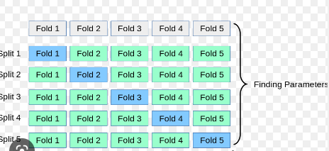

#### Principles
* Evaluate the peroformance of independent dataset without using the test set
* Split the dataset into k subsets
* Train the model on k-1 subsets and test on the remaining subset
* Repeat the process k times
* Involves partiooning
* K in range 5-10
#### Advantages
* Helps getting a good result even if the data is not big
* Improves the accuracy of the model
#### Disadvantages
* Computationally expensive
#### Python Implementation
```python
from sklearn.model_selection import cross_val_score
scores = cross_val_score(model, X, y, cv=5)
```
#### R Implementation
```R
model <- train(y ~ x1 + x2 + ... + xn, data=data, method='rf', trControl=trainControl(method='cv', number=5))
```
---
### Boosting vs Bagging vs Bootstrapping
* Boosting: Boosting is an ensemble learning technique that involves iteratively training models on subsets of the data, with each subsequent model focusing on the errors of the previous models. Boosting is designed to improve the accuracy of a model by reducing its bias, rather than its variance (as in bagging). Boosting is typically used with weak learners, such as decision stumps or shallow decision trees.
* Bootstrapping: Bootstrapping is a resampling technique that involves drawing samples from the dataset with replacement to create multiple subsets of the data. Bootstrapping is primarily used to estimate the sampling distribution of a statistic, such as the mean or variance. Bootstrapping can also be used in ensemble learning, such as bagging or random forest, to create multiple diverse subsets of the data for training separate models.
* Bagging: Bagging (Bootstrap Aggregation) is an ensemble learning technique that involves building multiple models on bootstrap samples of the original training dataset and combining their predictions to make a final prediction. Bagging is designed to reduce the variance of the model by creating diverse subsets of the data that are used to train separate models. Bagging can be used with any base model or algorithm that can be trained on a subset of the data, including decision trees, linear regression, and neural networks.


---
## 6. Model Evaluation
### Regression
#### Mean Absolute Error
* MAE = 1/n * sum(|y - y_hat|)
* Measures the average magnitude of the errors in a set of predictions, without considering their direction
* 0 is the best score
#### Mean Squared Error
* MSE = 1/n * sum((y - y_hat)^2)
* Measures the average of the squares of the errors
* 0 is the best score
#### Root Mean Squared Error
* RMSE = sqrt(MSE)
* Measures the average magnitude of the errors in a set of predictions, without considering their direction
* 0 is the best score
#### R2 Score
* R2 = 1 - (sum((y - y_hat)^2) / sum((y - y_mean)^2))
* Measures the proportion of the variance for a dependent variable that's explained by an independent variable or variables in a regression model
* 1 is the best score, 0 is the worst score, negative values are possible
### Classification
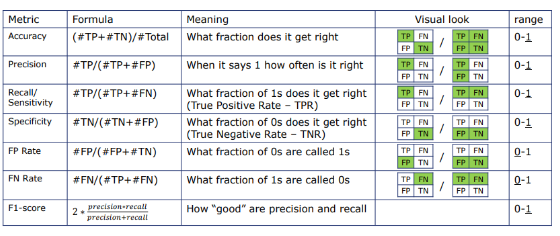

#### Confusion Matrix
* 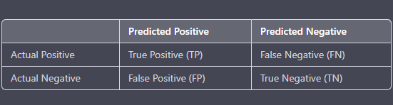
* A confusion matrix is a table that summarizes the performance of a classification model.
* Show the number of True Positives, True Negatives, False Positives and False Negatives.
    * TP - True Positive - the model predicted positive and the actual value is positive
    * TN - True Negative - the model predicted negative and the actual value is negative
    * FP - False Positive - the model predicted positive and the actual value is negative
    * FN - False Negative - the model predicted negative and the actual value is positive
#### Accuracy
* Accuracy = (TP + TN) / (TP + TN + FP + FN)
* Measures the proportion of correct predictions
* 1 is the best score
#### Precision/Specificity
* Precision = TP / (TP + FP)
* Measures the proportion of positive identifications that were actually correct
* 1 is the best score
#### Recall/Sensitivity
* Recall = TP / (TP + FN)
* Measures the proportion of actual positives that were correctly identified
* 1 is the best score
#### FN Rate
* FN Rate = FN / (FN + TP)
* Measures the proportion of actual positives that were incorrectly identified as negative
* 0 is the best score
#### FP Rate
* FP Rate = FP / (FP + TN)
* Measures the proportion of actual negatives that were incorrectly identified as positive
* 0 is the best score
#### F1 Score
* F1 = 2 * (Precision * Recall) / (Precision + Recall)
* Measures the balance between precision and recall
* 1 is the best score
#### ROC Curve
* 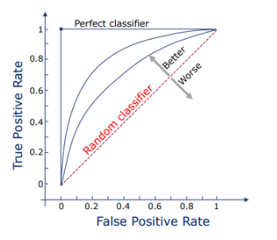
* A receiver operating characteristic (ROC) curve is a graph showing the performance of a classification model at all classification thresholds.
* True Positive Rate (Recall) is plotted against the False Positive Rate (1 - Specificity)
##### AUC
* AUC = 1 - (sum((x2 - x1) * (y1 + y2)) / 2)
* AUC is the area under the ROC curve
* 1 is the best score, 0.5 is the worst score
---
### Fitting
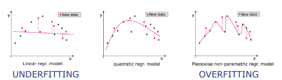

#### Underfitting
* The model is too simple to capture the underlying patterns in the data
* The model has high bias
* The model has low variance
* TO FIX: Increase the model complexity
#### Overfitting
* The model is too complex to capture the underlying patterns in the data
* The model has low bias
* The model has high variance
* TO FIX: Decrease the model complexity
#### Bias-Variance Explanation
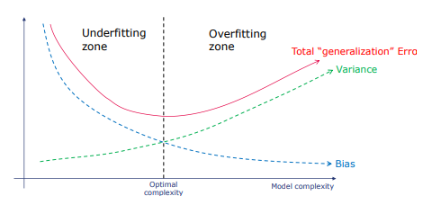

##### Bias
* Error due to wrong assumptions
* Model has limited flexibility
* Model cannot represent the data
##### Variance
* Error due to sensitivity to small fluctuations in the training set
* Model has high flexibility
* Model is too complex

#### Bias-Variance Tradeoff
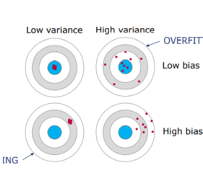

* The bias-variance tradeoff is a fundamental problem of supervised learning that occurs when trying to estimate the skill of a machine learning model on new data.
* <b>HIGH BIAS AND LOW VARIANCE:</b> Model is consistent but innacurate
* <b>LOW BIAS AND HIGH VARIANCE:</b> Model is accurate but inconsistent
---